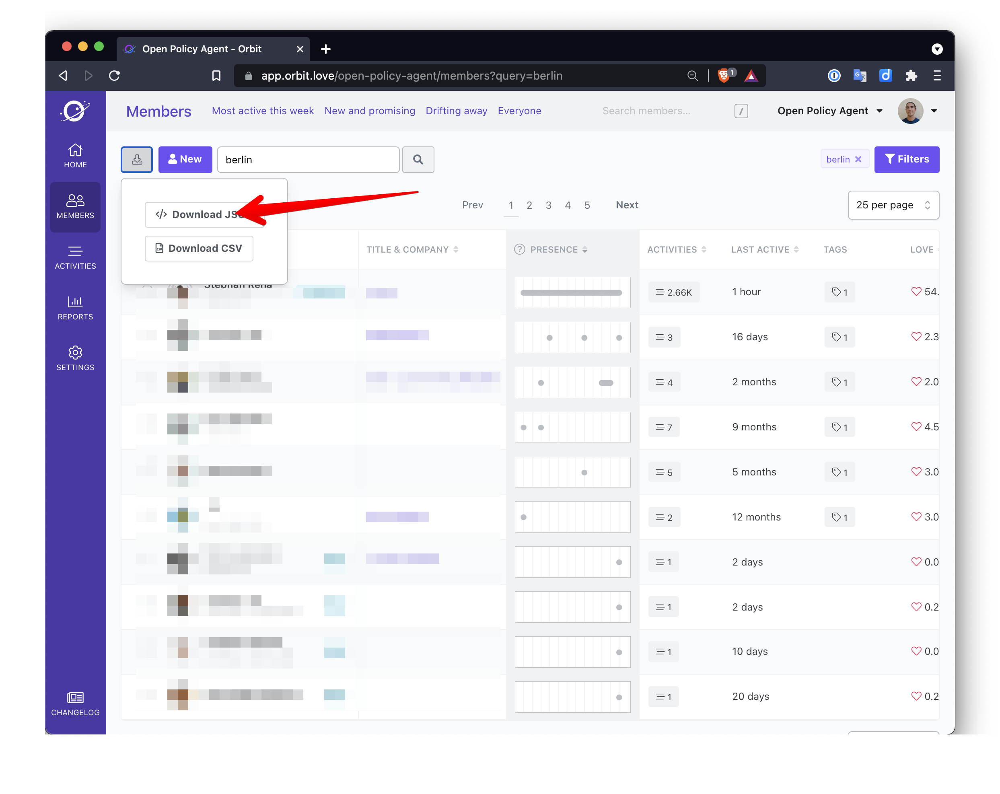
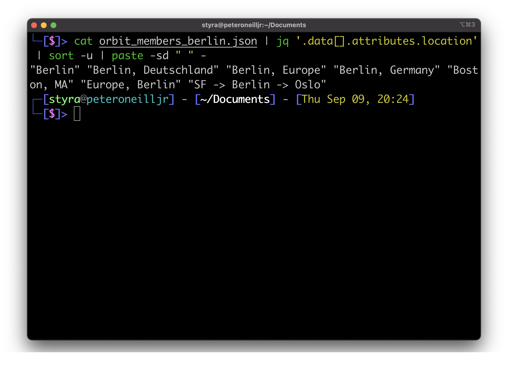
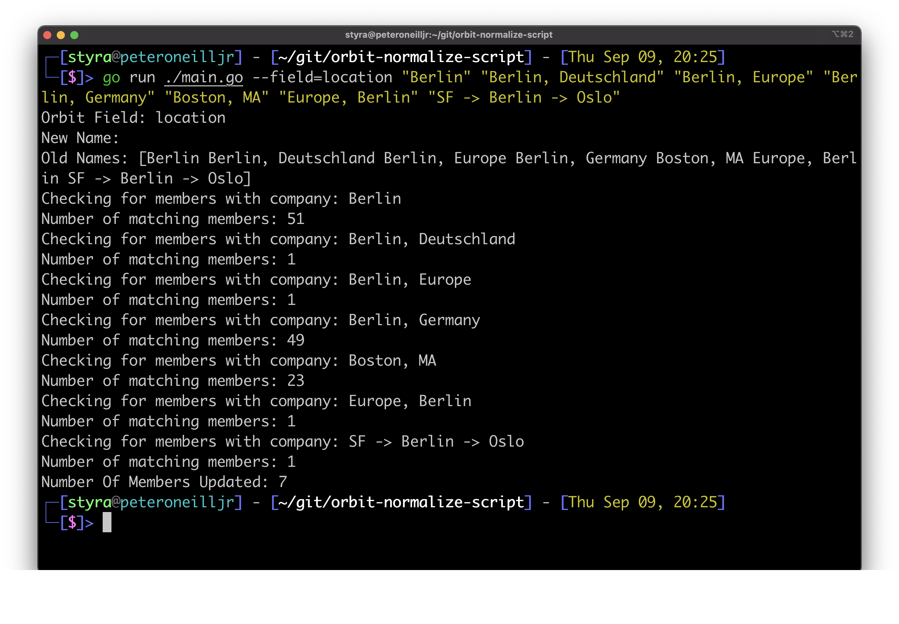
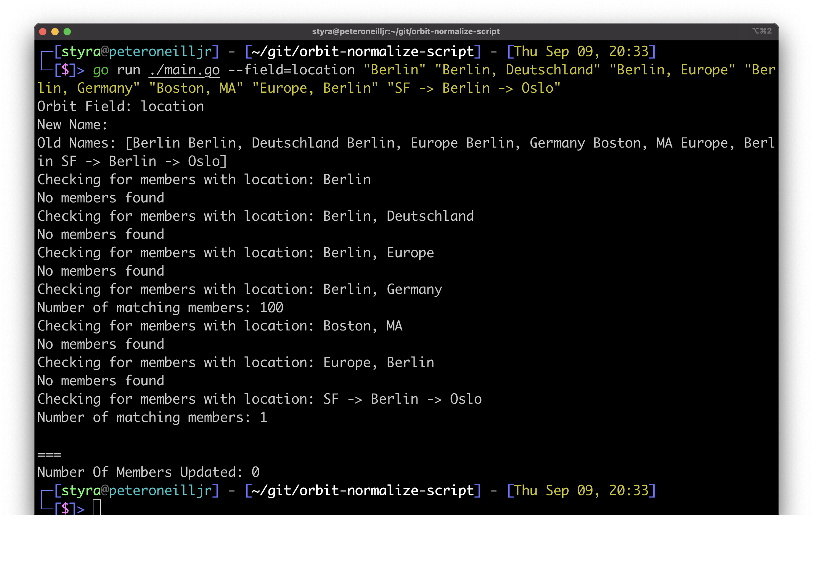

# Instructions

Hello, thanks for checking out my handy Orbit data normalizer tool. 

1. Search for members in Orbit GUI and download as JSON
    
1. Cat json file with jq to get a unique list of locations
    `cat results.json | jq '.data[].attributes.location' | sort -u | paste -sd " " -`
    
1. Check how many members exist for each location, don't worry without the `--new` this operations is read-only
    ` go run ./main.go --field=location "Berlin" "Berlin, Deutschland" "Berlin, Europe" "Berlin, Germany" "Boston, MA" "Europe, Berlin" "SF -> Berlin -> Oslo"`
    
1. Remove any locations you don't want to modify from the list.
1. Choose what you want all the locations to be called and apply changes with `--new` flag
    `go run ./main.go --field=location --new="Berlin, Germany" "Berlin" "Berlin, Deutschland" "Berlin, Europe" "Boston, MA" "Europe, Berlin"`
1. Rerun the command without the `--new` flag to check members have the new location
    

## Parameters

- `--field`: This should be *location* or *company*
- `--new`: The value to set for any matching members  
- Arguments: every space-separated string passed after the command will be added to the search list

- `ORBIT_API_KEY`: Set your Orbit API key as an environment variable
- `ORBIT_WORKSPACE_ID`: Set the Orbit workspace ID you want to modify